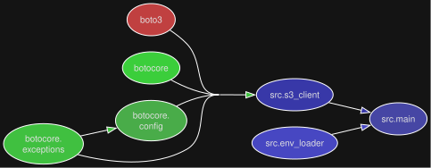

# Python project

### Project structure diagrams

##### Modular perspective

<p align="center">
  
</p>

##### Library dependencies perspective

<p align="center">
  
</p>

## Requirements

- [UV](https://github.com/astral-sh/uv) package manager
- [Task](https://taskfile.dev/docs/installation) runner

### Fast Windows dev

```commandline
task full-dev-native ; 
```

### Generate diagrams

```commandline
task generate-diagrams ; 
```
